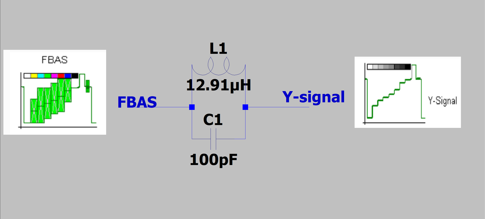
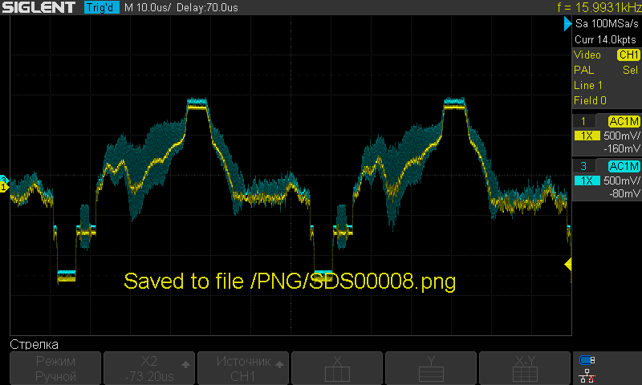
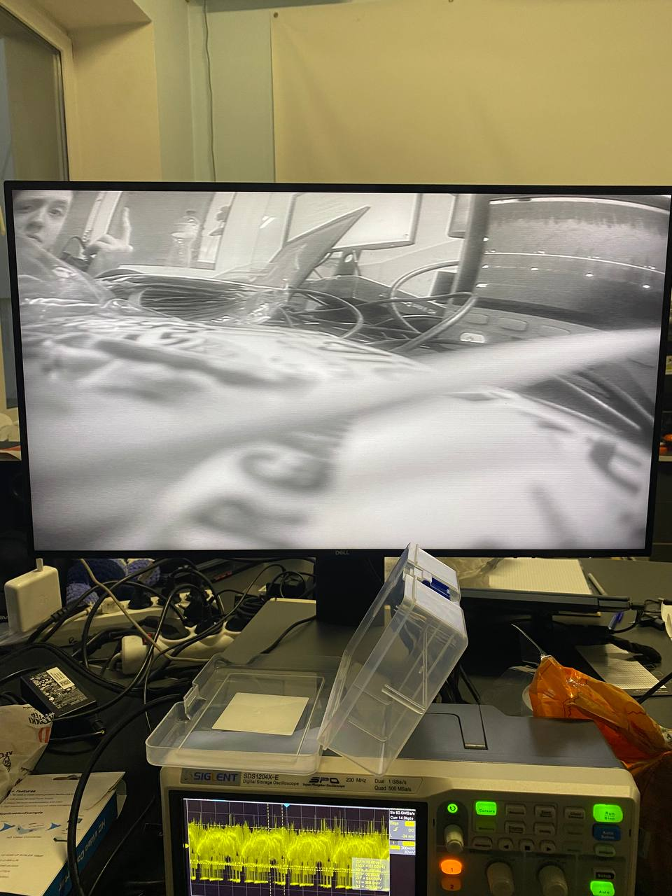
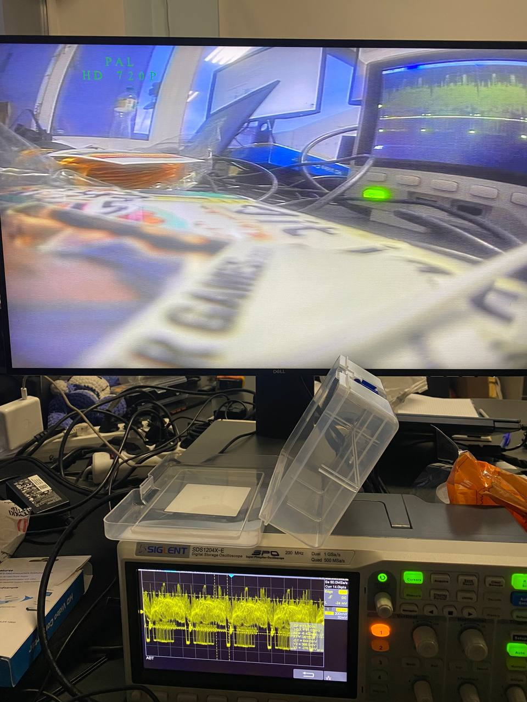

## Processing of the FBAS signal and the PAL runtime decoder

Passive analog filters separate the FBAS signal into the demodulated luminance signal and the still modulated chroma signal for further signal processing. In the FBAS signal band, the chroma signal occupies a bandwidth of around 1.2 MHz, symmetrical to the frequency of the color subcarrier. A maximum of 3.5 MHz of the 5 MHz remains for the luminance or Y signal.

Next, Y-signal denoted as luminance. 

So, Y-signal can be extarcted with using LC-filter with cut-off frequency as 4.43(Mhz)

|               LC-filter                         |                      Signals                        |
|:-----------------------------------------:|:-----------------------------------------------------:|
|  |  |

|               GrayScale                         |                      Original                        |
|:-----------------------------------------:|:-----------------------------------------------------:|
|  |  |

